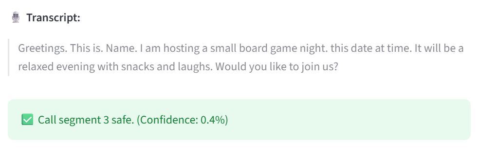
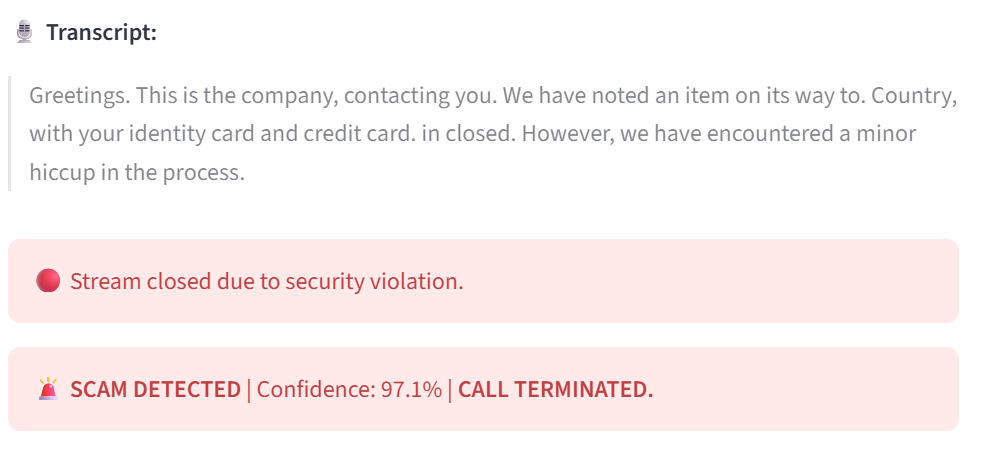
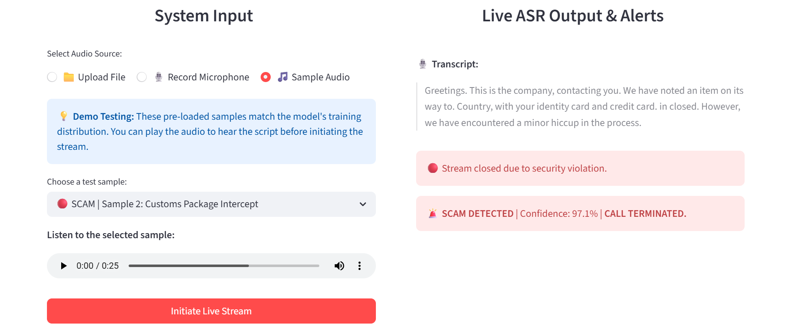
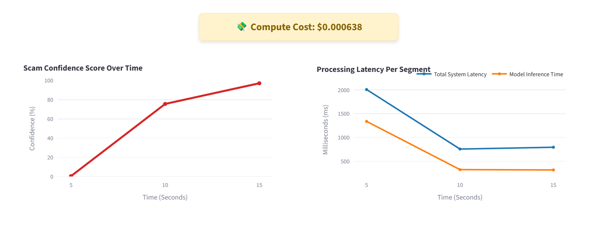

# Multimodal Fraud Detection System 🚨

An enterprise-grade real-time AI streaming pipeline that intercepts and terminates fraudulent phone calls using multimodal stateful fusion (audio + text).

Built with **Streamlit, FastAPI, WebSockets, Modal (Serverless T4 GPU), PyTorch, Whisper, and Wav2Vec2**.

---

## Key Features

• **Real-time multimodal fraud detection** (audio + text)  
• **Stateful conversation risk scoring** across call segments  
• **Serverless GPU inference** using Modal (T4 GPU)  
• **Sub-320ms inference latency** during streaming analysis  
• **Active call termination** when fraud confidence exceeds threshold  
• **Live monitoring dashboard** for model performance and cost tracking  

---

## Real-Time Multimodal Classification
The core of the system processes live audio streams via WebSockets, transcribing and evaluating call risk every 5 seconds. It assesses both **what** is being said (the text) and **how** it is being said (the tone of voice).

| 🟢 Safe Interaction | 🔴 Scam Interception |
| :---: | :---: |
|  |  |
| *Everyday conversations with a normal, relaxed tone result in a near-zero fraud score.* | *Aggressive tone and requests for sensitive information trigger a high fraud probability.* |

## Active Call Interception
Unlike batch-processing systems that analyze calls after the fact, this architecture acts as an active intrusion prevention system. It maintains a running memory of the conversation and terminates the call once a configured fraud confidence threshold is exceeded.

**Example: Pre-emptive Termination**
Below, a 25-second known scam script is fed into the system. The model does not wait for the audio to finish. At the **15-second mark**, the cumulative multimodal confidence hits 97.1%, and the system terminates the call stream before the script completes.

*The user interface locking down the session before the audio file completes.*

## Live Monitoring & Performance Tracking
The system includes a real-time monitoring dashboard for model performance and infrastructure usage. As the call progress, the dashboard tracks:

* **Fraud Probability:** A live graph showing the scam score rising or falling as the conversation continues.
* **Response Speed:** Tracks how long it takes for the AI to analyze each chunk of audio, ensuring there are no delays.
* **Live Processing Costs:** Displays real-time GPU inference cost.

*Live charts showing the exact moment the stream was cut and the speed of the AI analysis.*

---

## Technical Architecture & Performance

The system is built on a decoupled architecture to ensure model inference does not block the user interface. 

### Real-Time Streaming Pipeline
1. **Frontend (Streamlit):** Captures audio in 5-second chunks and sends raw bytes via **WebSockets** for low-latency communication.
2. **Backend (Modal + FastAPI):** A serverless Python environment that scales to a **T4 GPU** on demand.
3. **The Fusion Engine:** * **Whisper & BGE:** Converts audio to text and checks for fraudulent language patterns.
   * **Wav2Vec2:** Analyzes the raw audio waves to detect emotional stress and urgency.
   * **Stateful Memory:** The system remembers previous chunks to calculate a cumulative risk score.

### Latency & GPU Performance
Performance is critical for active interception. Once the system is running, the end-to-end processing time (Inference Latency) consistently stays **under 320ms**.

> **Note on Initial Latency:** The very first audio chunk typically takes longer (roughly 5-10 seconds) because the cloud provider is "warming up" the GPU and loading the 1.5GB of model weights into VRAM. All subsequent chunks are processed in near real-time.

---
## Dataset & Training Pipeline

The fraud detection model was trained using the **English Scam vs Non-Scam Phone Call Transcripts Dataset** from Kaggle, which contains labeled phone call scripts representing legitimate conversations and common scam attempts.

The dataset includes **~800 transcripts**:

| Class | Samples |
|------|------|
| Legitimate Calls | 400 |
| Scam Calls | 400 |

Each transcript was cleaned and converted into a structured dataset containing the call text and a binary fraud label.

Example format:

text | label  
--- | ---  
"Hello this is the pharmacy calling about your prescription refill..." | 0  
"You have been selected to receive a government grant..." | 1  

### Synthetic Audio Generation

Because the dataset contains **text-only transcripts**, synthetic speech was generated to enable audio analysis. Each transcript was converted into `.wav` audio using **Google Text-to-Speech (gTTS)**, creating a multimodal dataset:

text | label | audio_path  

### Feature Extraction

Two pretrained models were used to encode the conversation.

**Audio Features:** Speech signals were processed using **Wav2Vec2**, producing **2304-dimensional embeddings** that capture tone, cadence, and vocal stress.

**Text Features:** Transcripts were encoded using **BGE Base English v1.5**, producing **768-dimensional semantic embeddings**.

### Multimodal Fusion

The audio and text embeddings were merged into a single representation:

2304 audio features + 768 text features → **3072 multimodal features**

This allows the model to evaluate both **what is being said** and **how it is being said**, forming the input for the fraud classification models described in the following sections.

---

## Real-Time Inference Pipeline

During a live call, the system continuously analyzes streaming audio and updates a fraud risk score as the conversation progresses.

### Streaming Processing Flow

1. **Audio Stream**  
   The frontend sends **5-second audio chunks** to the backend using WebSockets.

2. **Speech Transcription**  
   Each chunk is transcribed using **Whisper**, producing a short transcript segment.

3. **Conversation Memory**  
   The new transcript and audio are appended to the **cumulative call history**, allowing the model to evaluate the full conversation context rather than only the latest segment.

4. **Feature Extraction**

   **Audio Features**  
   Processed using **Wav2Vec2**, capturing vocal tone, cadence, urgency, and stress patterns.

   **Text Features**  
   Encoded using **BGE embeddings**, capturing semantic meaning and scam-related language patterns.

5. **Multimodal Fusion**

   The features are combined into a single vector:

   2304 audio features + 768 text features = **3072 multimodal features**

6. **Fraud Probability Prediction**

   The fused vector is passed into the trained **PyTorch fusion classifier**, which outputs a fraud probability between 0.0 and 1.0.

7. **Decision Threshold**

   If the fraud probability exceeds **0.85**, the system triggers a scam alert and terminates the call.

### Stateful Conversation Analysis

Unlike traditional models that evaluate each segment independently, this system maintains **stateful memory of the entire call**.  
As more audio is received, the model continuously recomputes the fraud probability using the full conversation history.

This allows the system to detect patterns such as:

- escalation in pressure or urgency  
- repeated requests for financial information  
- impersonation tactics developing over time

---

## Future Improvements

The system is still under active development. Planned improvements include:

**Data Drift Detection**  
Monitoring incoming call patterns to detect shifts in language or speech behavior that may reduce model performance over time.

**Automated Model Retraining**  
Building a retraining pipeline that periodically updates the model using newly collected call data.

**Human-in-the-Loop (HITL) Learning**  
When the model's confidence falls within an uncertain range, the system will flag the interaction for human review.  
These reviewed cases can then be incorporated into the training dataset to continuously improve the model.

**Active Learning Pipeline**  
Prioritizing uncertain or borderline predictions for annotation to improve training efficiency and model robustness.
