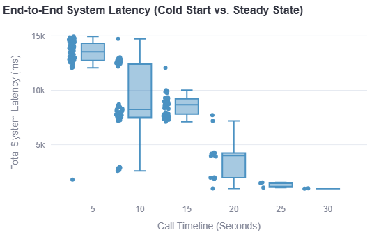
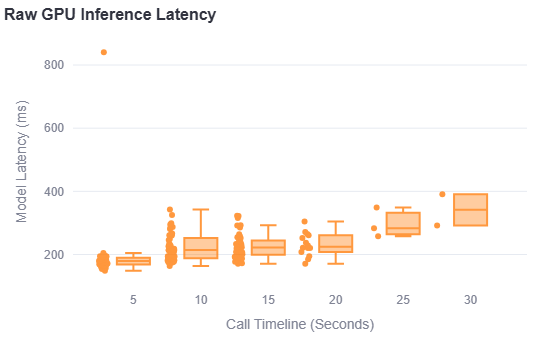

# Architecture & Scaling Evolution

This document tracks the engineering evolution of our real-time streaming fraud detection system. It details the initial baseline architecture, the scaling bottlenecks encountered during live concurrent streaming, and the architectural pivot required to achieve production-grade latency.

---

## V1: The Baseline Architecture (Stateless Full-Context Processing)

### How We Built It
The V1 system was designed as a stateless pipeline optimized for maximum accuracy. 
* **Data Generation:** We generated 800 synthetic audio files using Google TTS (gTTS) based on real scam and legitimate call transcripts.
* **Feature Extraction:** We passed the *entire* raw audio file through `facebook/wav2vec2-base`, producing a 2304-dimensional embedding and the transcript through `BAAI/bge-base-en-v1.5` , producing a 768-dimensional embedding.
* **Classification:** We concatenated these into a 3072-dimensional multimodal feature vector and trained a standard PyTorch Feed-Forward Neural Network (`MultimodalFusionClassifier`) and an XGBoost baseline.

### The Win
The model performed extremely well in isolated offline evaluation. The PyTorch MLP achieved **98.7% accuracy**.

To achieve this in a streaming environment, the backend utilized a `cumulative_audio` array. As the WebSocket received new 5-second chunks, they were appended to the previous chunks. The model re-processed the entire conversation history from the beginning, giving the stateless model simulated "memory." During early streaming tests, the system successfully terminated scam calls right around the 15-second mark. 

---

### The Breakage at Scale (The 50-Call Load Test)

The V1 architecture broke down immediately under heavy concurrent load. We simulated 50 concurrent WebSocket streams targeting a single NVIDIA T4 GPU container.

**Visualizing the Bottleneck:**
Below is the telemetry from the 50-stream concurrent load test. 

*Figure 1: System latency queues to critical levels (15s+) as the single GPU struggles to clear the synchronous backlog.*

*Figure 2: The O(N²) trap in action. As the `cumulative_audio` array grows from 5s to 30s, the raw mathematical execution time on the GPU steadily increases, choking the pipeline.*

#### What Broke
* **Raw GPU Speed:** The models were fully optimized. Raw PyTorch inference time initially hovered around ~200 ms per call.
* **System Latency:** The end-to-end system latency spiked massively, queueing up to **10,000ms – 15,000ms+**.

#### The Root Cause: The $O(N^2)$ Trap
The `cumulative_audio` array was a fatal infrastructure flaw at scale. As a call progressed from 5 seconds to 30 seconds, the array grew. Because Transformers rely on Self-Attention (which scales quadratically at O(N²)), the compute and VRAM requirements exploded as the calls got longer.

A single T4 GPU could not process 50 massive, growing audio arrays sequentially. Calls were forced to wait in the event loop for up to 15 seconds, defeating the purpose of a real-time monitoring system.

---

### The Batching Roadblock

To fix the queue, the immediate thought was to implement dynamic batching (passing all 50 calls to the GPU simultaneously). This exposed another flaw in the `cumulative_audio` approach: **jagged input tensors.**

In a live environment, concurrent calls are at different stages. Caller A might be at 5 seconds, while Caller B is at 30 seconds. To batch these into a single PyTorch tensor, we would have to pad the 5-second call with 25 seconds of zeroes. This wastes massive amounts of GPU compute and VRAM on dead silence, leading directly to imminent Out-Of-Memory (OOM) crashes.

---
*(Note: V2 Stateful Architecture to be documented later as the system evolves).*